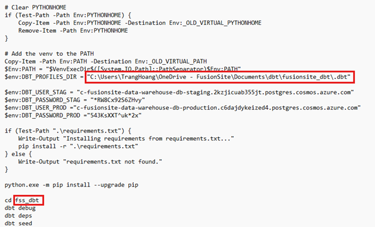

Welcome to your new dbt project!
# Set up
## Install Python, Conda, Pip, git 
1. Conda
- Download **Anaconda** from [here](https://www.anaconda.com/download/success) (We download Anaconda instead of conda)
- env: Python 3.12
- When you are done with downloading, check version by opening terminal `python --v`. It should
display conda version_number
- If not working or showing either, check the steps below:
    - In order to link powershell with anaconda environment;
    - You need the path that points to your anaconda, it would be something like this `C:\Users\UserName\anaconda3\`
    - Open environment variables from your Windows and add these path above in - this step need help from IT to grant you access to edit environment path
        - `C:\Users\UserName\anaconda3\`
        - `C:\Users\UserName\anaconda3\Scripts`
        - `C:\Users\UserName\anaconda3\Library\bin`
    
    - Or you can run the following cli in command line:
    env : Path+ =′′; C : \Users\UserName\anaconda3; C : \Users\UserName\anaconda3\Scripts; C : \Users\ env: Path 
        - there should be 3 above paths. 
        - Initialize the hook between Anaconda and Powershell by running `conda init powershell`
    - Restart powershell by opening and closing terminal
    - Your set up is now ready, reopen powershell on the left you should see `(base) PS:C:\Users...`

2. git
- [Git- Downloads](https://git-scm.com/downloads) 

3. pip install
- This installation would be included when you downloaded anaconda

Notes:
- You might need to in order to use pip install in powershell instead of using conda evn:
    - open terminal. "Run As Administration"
        `conda init powershell`

## Create and activate a python env in conda
- `conda create --name my_env`
- `conda create --name my_env python=3.8` : creates environment

Notes
- Make sure your Python version is ≤ 3.10

## Set up DBT
After creating the environment, run:
- `conda activate my_env`
- `python -m pip install dbt-core dbt-postgres`

Notes
- For this dbt set up, we want to download dbt core. if you do pip install dbt it would lead you to dbt cloud cli
- [Additional resources](https://docs.getdbt.com/docs/core/pip-install) 

## DBT quick intro
### DBT definitions
- profiles.yml : This is the place where dbt materializes the objects with the models and
transformations defined in your project.
- dbt_project.yml : where you initialize your project and how should they define your schema given
productions
- packages.yml : a library that already have predefine macro that you can use for testing


### DBT setup- initialize a project
1. Create requirement.txt
Create a folder for your DBT project. Inside that folder, create a file named `requirements.txt` and add the following contents:

```text
dbt-core==1.3.0
dbt-postgres==1.3.0
pytz==2022.7
```

2. Create a Python virtual environment and update the scripts
- Use `python -m venv your_env_name` 
- this would download all the required package/libraries listed in the `requirements.txt`
- update activate file
    - Path to your virtual environment
    - Name of your virtual environment


3. Activate that env
- On Window `\your_env_name\Scripts\Activate.ps1`
- On Mac `source dbt_env/bin/activate`
- On Linux `source dbt_env/bin/activate`

4. Initialize a project 
- In Postgres, make sure you have the following setup:
    - Have your database name and have a staging schema. 
    - The dbt name and schema name needs to be exactly the same as when you listed out in DBT.
    - Naming is case insensitive.
- Have all of the information below ready:
    - host, port, username, dbname, schema
- Run `dbt init`
- This command initializes DBT and creates all the necessary folders for your DBT project. It will then prompt you for the information from Step 5—enter the required details when prompted.
- In file called `.dbt/profiles.yml` You can check multiple connection points and add more database and schema
    - Your dbt profile would be located in your personal .dbt path that doesn't live in the same directory as you development
    - Find your dbt profile and update Activate.ps1 file for
        - Path to your profile.yml
        - Path to your git repo


- Once you have everything setup; do this to check if your dbt setup is correct
    - `dbt debug` : this would test your connection
        - Make sure that your dbt debug is currently pointed at your desired `profiles.yml` and your `dbt_project.yml` file
        - If the profiles.yml is not correctly pointed. you can do the following:
            - For window `$env:DBT_PROFILE_DIR = "the_path_has_profiles"`
            - For Mac, `export DBT_PROFILES_DIR=path/to/directory`
        - You can add mutliple database and schema that you want in the yml file; when you create dbt model, just be specific `dbname.schema. table1` format


6. Test the connection to PostgreSQL
- Turn on DBT/ Activate the env if needed (step 3)
- Ensure you are in the Git repository folder
- Run `dbt run --select +mbr_report`
- Open PostgreSQL and verify whether new tables have been created in your schema

### Personal = How to turn on DBT
- Run `.\dbt_env\Scripts\activate_n_install.ps1` - activate the python env with install requirements package
    - All of the environment setup for profiles.yml would located in Activate.ps1
- Run the dependencies:
    - `dbt deps`


### Using the starter project

Try running the following commands:
- dbt run
- dbt test


### Resources:
- Learn more about dbt [in the docs](https://docs.getdbt.com/docs/introduction)
- Check out [Discourse](https://discourse.getdbt.com/) for commonly asked questions and answers
- Join the [chat](https://community.getdbt.com/) on Slack for live discussions and support
- Find [dbt events](https://events.getdbt.com) near you
- Check out [the blog](https://blog.getdbt.com/) for the latest news on dbt's development and best practices
